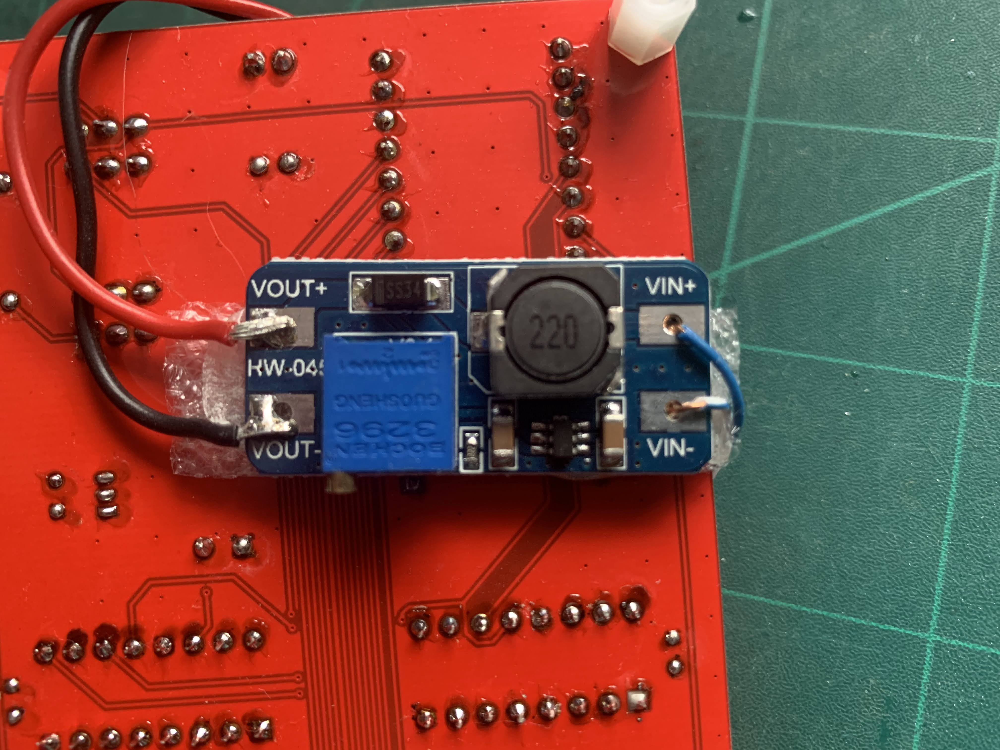

Basic eprom programmer using Arduino Nano.

This is the Arduino scetch needed for an Eprom programmer for 27C256 and 27C512 Eprom chips.
It doesn't need any special PC software for operation.
A terminal software with XMODEM support for uploading the binary is sufficient.
On Linux you can use Minicom and on Windows TeraTerm.
Also `console.py` should work fine.

The onboard CLI looks like this:
```
Started EPROM Programmer V 1.3 12/8/23
  a nnnnn - Set address (for debug)
  r nnnnn mmmmm - show mmmmm bytes at address nnnnn
  i nnnnn mmmmm - show mmmmm bytes at address nnnnn in Intex Hex format
  w nnnnn - write to eprom from binary file using xmodem transfer
  m nnnnn mmmmm - md5sum rom content starting at nnnnn for mmmmmm bytes long
  b nnnnn mmmmm - Check for FF's from nnnnn for mmmmmm bytes long
  h repeat this menu
%
```

This project was put together using bits from other designs. The main aim was just to
get a working programmer for these two chips.

This was used to program Eproms for use with various "Retro" design z80 computers,
mostly based on RC2014 designs.

The circuit has been uploaded. https://github.com/coopzone-dc/Eprom-27c512-27c256/blob/main/Schematic_Eprom_2023-08-19.pdf
I'm going to publish this using EasyEDA as soon as I get time.

https://www.instructables.com/Classic-27c256-27c512-EPROM-Programmer-Using-Nano/

I have also published the EDA design on OSHWLab:

https://oshwlab.com/mycoopzone/eprom_copy

The board required 12.7v supply to program the Eproms.(most are happy between 12.0v and 13.0v), to provide this I use a cheap chinese generic step up supply board
it has a 5v input and the output can be adjusted. the photo shows the board attached to the underside of the pcb.



Have fun
